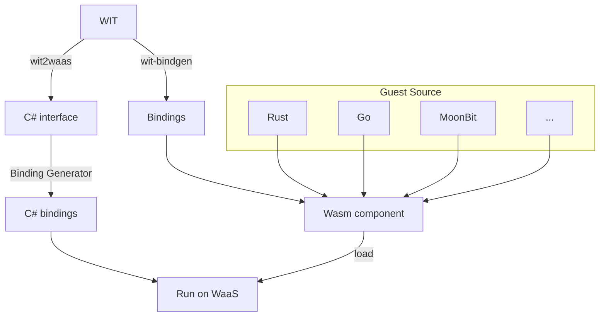

import DocCardList from '@theme/DocCardList';

:::info
About an overview of Component Model, see [Component Model Tutorial](./../getting-started/component-model).
:::

### Component Model Workflow

### WIT

WIT is an IDL that defines a set of functions to import and export WebAssembly components in the Component Model.

In WaaS, a WIT file is required to perform FFI between components and hosts (C#).

If you want to use a WebAssembly component created externally from WaaS, you need to obtain the WIT file that the component exposes.  
Alternatively, if the host side defines a set of functions required by the WebAssembly component (such as a plugin system or event system), the host side must create and expose the WIT.

### wit2waas

A CLI tool that converts WIT files to C# type definitions for WaaS.

### Binding Generator

A Source Generator that generates the necessary binding code internally from the type definitions generated by wit2waas. It comes with WaaS.

This allows you to call functions exposed by components in the same way as regular C#.

### wit-bindgen

A CLI tool that generates bindings for each guest language from WIT.

<DocCardList />