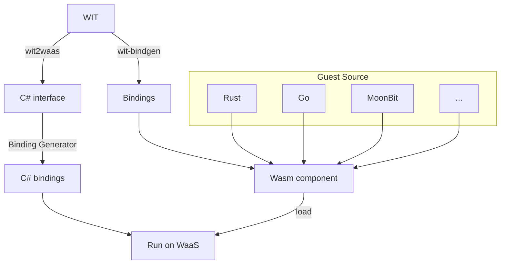

import DocCardList from '@theme/DocCardList';

:::info
Component Model についての概要は 「[Component Model ではじめる](./../getting-started/component-model.md)」 も参照してください。
:::

### Component Model のワークフロー

<DocCardList />