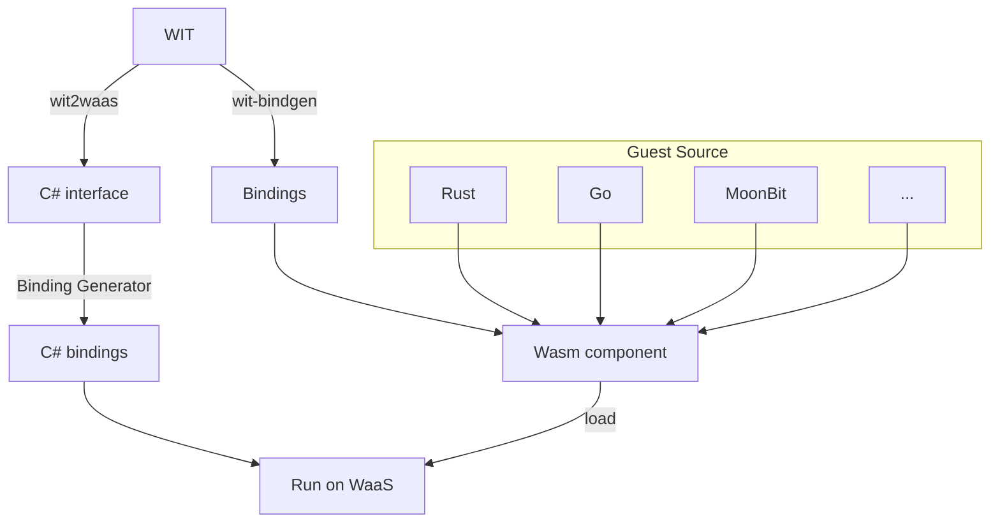

import DocCardList from '@theme/DocCardList';

:::info
Component Model についての概要は 「[Component Model ではじめる](./../getting-started/component-model.md)」 も参照してください。
:::

### Component Model のワークフロー

### WIT

WIT は、Component Model において、WebAssembly コンポーネントのインポート・エクスポートする機能のセットを定義する IDL です。

WaaS では、コンポーネントとホスト (C#) の間で FFI 等を行うために WIT ファイルが必要です。

外部で作成された WebAssembly コンポーネントを WaaS から使用したい場合は、そのコンポーネントが公開する WIT ファイルを取得する必要があります。  
あるいは、ホスト側が WebAssembly コンポーネントに必要な機能のセットを規定する場合（プラグインシステムやイベントシステムなど）は、ホスト側が WIT を作成して公開する必要があります。

### wit2waas

WIT ファイルを WaaS 用の C# 型定義に変換する CLI ツールです。

### Binding Generator

wit2waas によって生成された型定義から、内部的に必要なバインディングコードを生成する Source Generator です。WaaS に付属しています。

これによって、コンポーネントの公開する関数等を通常の C# と同じ感覚で呼び出すことができます。

### wit-bindgen

WIT から各ゲスト言語用のバインディングを生成する CLI ツールです。

<DocCardList />